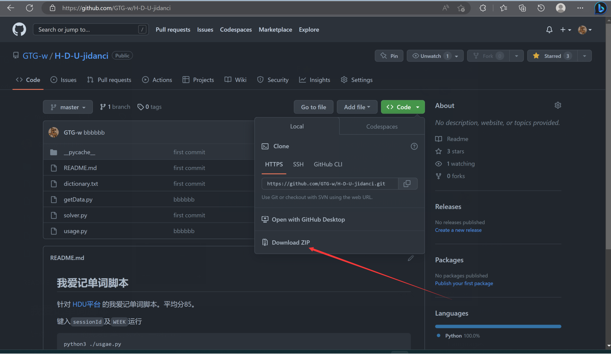
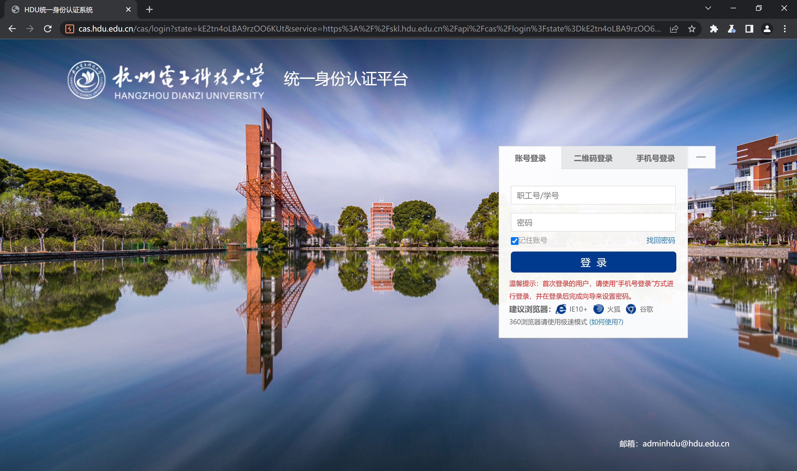
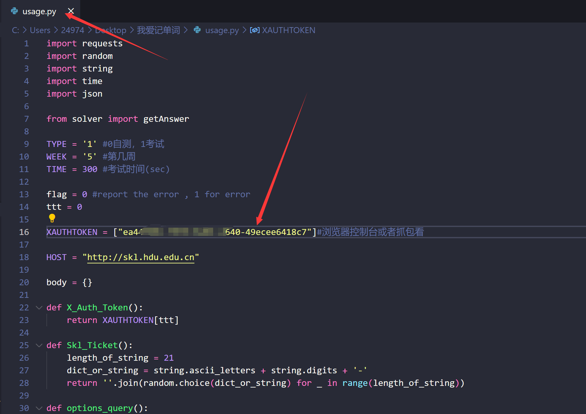
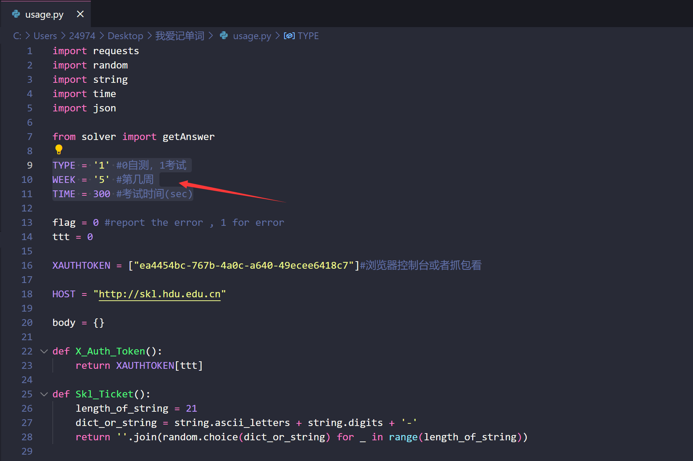
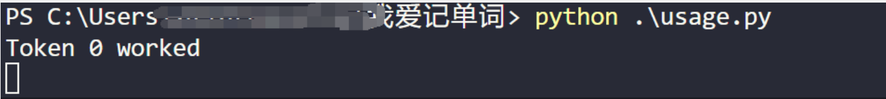

## 我爱记单词脚本

针对 [HDU平台](https://skl.hduhelp.com/#/call/course) 的我爱记单词脚本。平均分85。（每周题库不同，请使用前获取最新dictionary.txt）

键入`sessionId`及`WEEK`运行

```
python3 ./usgae.py
```

即可刷一次考试。

考试数据存放在`dictionary.txt`，可通过`getData.py`获取最新题目数据。

`getData.py`支持多个 Token 提高刷数据效率，需要更改 TIME 参数。

### 详细步骤

一、下载项目源码，选择 `Download Zip`并解压



二、登录[杭电上课啦网页版平台](http://skl.hduhelp)



三、进入网页版`上课啦`界面


四、打开控制台，输入 localStorage.sessionId ，回车。


五、复制得到的字符串，粘贴到项目下的`usage.py`的对应位置。



六、选择合适的参数



七、运行脚本`python3 ./usage.py`。这个时候考试已经发起了



八、等待脚本运行完成。等待的时间大概比设定的 TIME 值多一秒。结束即完成。
